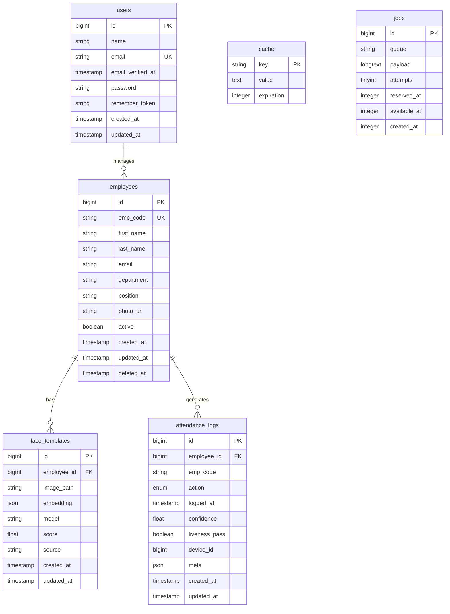

# Face Attendance System - Database Schema Documentation

## Overview

The Face Attendance System uses SQLite as the primary database with a well-structured schema designed for face recognition, employee management, and attendance tracking.

---

## Database Schema Diagram



---

## Table Descriptions

### users Table
Stores system administrators and users who can manage the attendance system.

**Columns:**
- `id` (bigint, primary key): Unique identifier
- `name` (string): User's full name
- `email` (string, unique): User's email address
- `email_verified_at` (timestamp, nullable): Email verification timestamp
- `password` (string): Hashed password
- `remember_token` (string, nullable): Remember me token
- `created_at` (timestamp): Record creation timestamp
- `updated_at` (timestamp): Record update timestamp

**Indexes:**
- Primary key on `id`
- Unique index on `email`

**Relationships:**
- One-to-many with `employees` (manages)

### employees Table
Stores employee information and basic details.

**Columns:**
- `id` (bigint, primary key): Unique identifier
- `emp_code` (string, unique): Employee code (e.g., EMP001)
- `first_name` (string): Employee's first name
- `last_name` (string): Employee's last name
- `email` (string, nullable): Employee's email address
- `department` (string, nullable): Department name
- `position` (string, nullable): Job position
- `photo_url` (string, nullable): Profile photo URL
- `active` (boolean, default: true): Employment status
- `created_at` (timestamp): Record creation timestamp
- `updated_at` (timestamp): Record update timestamp
- `deleted_at` (timestamp, nullable): Soft delete timestamp

**Indexes:**
- Primary key on `id`
- Unique index on `emp_code`
- Index on `active`
- Index on `deleted_at` (for soft deletes)

**Relationships:**
- Many-to-one with `users` (managed by)
- One-to-many with `face_templates` (has)
- One-to-many with `attendance_logs` (generates)

**Business Rules:**
- `emp_code` must be unique across all employees
- `active` employees can have face templates and attendance logs
- Soft deletes preserve data integrity

### face_templates Table
Stores face recognition templates and embeddings for each employee.

**Columns:**
- `id` (bigint, primary key): Unique identifier
- `employee_id` (bigint, foreign key): Reference to employees table
- `image_path` (string): Path to stored face image
- `embedding` (json): Face embedding vector (array of floats)
- `model` (string): Face recognition model used
- `score` (float, nullable): Confidence score from model
- `source` (string): Source of the template (face_capture, upload, etc.)
- `created_at` (timestamp): Record creation timestamp
- `updated_at` (timestamp): Record update timestamp

**Indexes:**
- Primary key on `id`
- Foreign key index on `employee_id`
- Index on `model`
- Index on `source`

**Relationships:**
- Many-to-one with `employees` (belongs to)

**Business Rules:**
- Each employee can have multiple face templates
- `embedding` must be a valid JSON array
- `image_path` must reference a valid file
- Templates are not deleted when employee is soft deleted

### attendance_logs Table
Stores attendance records for each employee.

**Columns:**
- `id` (bigint, primary key): Unique identifier
- `employee_id` (bigint, foreign key): Reference to employees table
- `emp_code` (string): Employee code (denormalized for performance)
- `action` (enum): Attendance action (time_in, time_out)
- `logged_at` (timestamp): When attendance was logged
- `confidence` (float, nullable): Recognition confidence score
- `liveness_pass` (boolean, nullable): Liveness detection result
- `device_id` (bigint, nullable): Device identifier
- `meta` (json, nullable): Additional metadata
- `created_at` (timestamp): Record creation timestamp
- `updated_at` (timestamp): Record update timestamp

**Indexes:**
- Primary key on `id`
- Foreign key index on `employee_id`
- Index on `emp_code`
- Index on `action`
- Index on `logged_at`
- Composite index on `(employee_id, logged_at)`

**Relationships:**
- Many-to-one with `employees` (belongs to)

**Business Rules:**
- `action` must be either 'time_in' or 'time_out'
- `logged_at` cannot be in the future
- `confidence` should be between 0.0 and 1.0
- Records are not deleted when employee is soft deleted

### cache Table
Laravel's cache storage table.

**Columns:**
- `key` (string, primary key): Cache key
- `value` (text): Cached value
- `expiration` (integer): Expiration timestamp

### jobs Table
Laravel's job queue table.

**Columns:**
- `id` (bigint, primary key): Unique identifier
- `queue` (string): Queue name
- `payload` (longtext): Job payload
- `attempts` (tinyint): Number of attempts
- `reserved_at` (integer, nullable): When job was reserved
- `available_at` (integer): When job becomes available
- `created_at` (integer): Job creation timestamp

---

## Data Types and Constraints

### String Fields
- **VARCHAR(255):** Standard string fields
- **VARCHAR(50):** Short strings (emp_code)
- **TEXT:** Long text fields
- **LONGTEXT:** Very long text fields (job payloads)

### Numeric Fields
- **BIGINT:** Primary keys and foreign keys
- **FLOAT:** Decimal numbers (confidence scores)
- **TINYINT:** Small integers (attempts)
- **INTEGER:** Standard integers

### Date/Time Fields
- **TIMESTAMP:** Standard timestamps
- **INTEGER:** Unix timestamps (for jobs)

### JSON Fields
- **JSON:** Face embeddings, metadata
- **LONGTEXT:** Job payloads

### Boolean Fields
- **BOOLEAN:** True/false values
- **TINYINT(1):** Boolean representation

---

## Indexes and Performance

### Primary Indexes
- All tables have primary key indexes on `id`
- `users.email` has unique index
- `employees.emp_code` has unique index

### Foreign Key Indexes
- `face_templates.employee_id` → `employees.id`
- `attendance_logs.employee_id` → `employees.id`

### Performance Indexes
- `employees.active` for filtering active employees
- `employees.deleted_at` for soft delete queries
- `attendance_logs.logged_at` for date range queries
- `attendance_logs.action` for action filtering
- Composite index on `(employee_id, logged_at)` for employee attendance history

### Query Optimization
- Use `emp_code` in attendance_logs for faster joins
- Soft delete indexes for efficient filtering
- Composite indexes for common query patterns

---

## Relationships and Constraints

### Foreign Key Constraints
```sql
-- Face templates belong to employees
ALTER TABLE face_templates 
ADD CONSTRAINT fk_face_templates_employee_id 
FOREIGN KEY (employee_id) REFERENCES employees(id) 
ON DELETE CASCADE;

-- Attendance logs belong to employees
ALTER TABLE attendance_logs 
ADD CONSTRAINT fk_attendance_logs_employee_id 
FOREIGN KEY (employee_id) REFERENCES employees(id) 
ON DELETE SET NULL;
```

### Check Constraints
```sql
-- Attendance action validation
ALTER TABLE attendance_logs 
ADD CONSTRAINT chk_attendance_action 
CHECK (action IN ('time_in', 'time_out'));

-- Confidence score validation
ALTER TABLE attendance_logs 
ADD CONSTRAINT chk_confidence_range 
CHECK (confidence >= 0.0 AND confidence <= 1.0);
```

### Unique Constraints
```sql
-- Unique employee codes
ALTER TABLE employees 
ADD CONSTRAINT uk_employees_emp_code 
UNIQUE (emp_code);

-- Unique user emails
ALTER TABLE users 
ADD CONSTRAINT uk_users_email 
UNIQUE (email);
```

---

## Data Integrity

### Soft Deletes
- `employees` table uses soft deletes
- `deleted_at` timestamp marks deleted records
- Related records (face_templates, attendance_logs) are preserved
- Queries automatically filter out soft-deleted records

### Cascade Rules
- **Face Templates:** CASCADE DELETE (if employee is hard deleted)
- **Attendance Logs:** SET NULL (preserve audit trail)
- **Users:** RESTRICT (prevent deletion if managing employees)

### Data Validation
- **Required Fields:** emp_code, first_name, last_name
- **Format Validation:** email format, emp_code format
- **Range Validation:** confidence scores, timestamps
- **Enum Validation:** attendance actions

---

## Migration Files

### Create Users Table
```php
// 0001_01_01_000000_create_users_table.php
Schema::create('users', function (Blueprint $table) {
    $table->id();
    $table->string('name');
    $table->string('email')->unique();
    $table->timestamp('email_verified_at')->nullable();
    $table->string('password');
    $table->rememberToken();
    $table->timestamps();
});
```

### Create Employees Table
```php
// 2025_10_08_050000_create_employees_table.php
Schema::create('employees', function (Blueprint $table) {
    $table->id();
    $table->string('emp_code', 50)->unique();
    $table->string('first_name');
    $table->string('last_name');
    $table->string('email')->nullable();
    $table->string('department')->nullable();
    $table->string('position')->nullable();
    $table->string('photo_url')->nullable();
    $table->boolean('active')->default(true);
    $table->timestamps();
    $table->softDeletes();
});
```

### Create Face Templates Table
```php
// 2025_10_08_050010_create_face_templates_table.php
Schema::create('face_templates', function (Blueprint $table) {
    $table->id();
    $table->foreignId('employee_id')->constrained()->onDelete('cascade');
    $table->string('image_path');
    $table->json('embedding');
    $table->string('model');
    $table->float('score')->nullable();
    $table->string('source');
    $table->timestamps();
});
```

### Create Attendance Logs Table
```php
// 2025_10_08_050020_create_attendance_logs_table.php
Schema::create('attendance_logs', function (Blueprint $table) {
    $table->id();
    $table->foreignId('employee_id')->constrained()->onDelete('set null');
    $table->string('emp_code');
    $table->enum('action', ['time_in', 'time_out']);
    $table->timestamp('logged_at');
    $table->float('confidence')->nullable();
    $table->boolean('liveness_pass')->nullable();
    $table->bigInteger('device_id')->nullable();
    $table->json('meta')->nullable();
    $table->timestamps();
});
```

---

## Sample Data

### Users
```sql
INSERT INTO users (name, email, password, email_verified_at, created_at, updated_at) VALUES
('Admin User', 'admin@example.com', '$2y$10$92IXUNpkjO0rOQ5byMi.Ye4oKoEa3Ro9llC/.og/at2.uheWG/igi', NOW(), NOW(), NOW());
```

### Employees
```sql
INSERT INTO employees (emp_code, first_name, last_name, email, department, position, active, created_at, updated_at) VALUES
('EMP001', 'John', 'Doe', 'john@example.com', 'IT', 'Developer', 1, NOW(), NOW()),
('EMP002', 'Jane', 'Smith', 'jane@example.com', 'HR', 'Manager', 1, NOW(), NOW()),
('EMP003', 'Bob', 'Johnson', 'bob@example.com', 'Finance', 'Analyst', 1, NOW(), NOW());
```

### Face Templates
```sql
INSERT INTO face_templates (employee_id, image_path, embedding, model, score, source, created_at, updated_at) VALUES
(1, 'face_templates/1/face.jpg', '[0.1, 0.2, 0.3, 0.4, 0.5]', 'face_recognition_dlib', 0.95, 'face_capture', NOW(), NOW()),
(2, 'face_templates/2/face.jpg', '[0.6, 0.7, 0.8, 0.9, 1.0]', 'face_recognition_dlib', 0.92, 'face_capture', NOW(), NOW());
```

### Attendance Logs
```sql
INSERT INTO attendance_logs (employee_id, emp_code, action, logged_at, confidence, liveness_pass, device_id, meta, created_at, updated_at) VALUES
(1, 'EMP001', 'time_in', '2024-01-15 09:00:00', 0.95, 1, 1, '{"browser": "Chrome", "ip": "192.168.1.100"}', NOW(), NOW()),
(1, 'EMP001', 'time_out', '2024-01-15 17:00:00', 0.93, 1, 1, '{"browser": "Chrome", "ip": "192.168.1.100"}', NOW(), NOW());
```

---

## Query Examples

### Get Employee with Face Templates
```sql
SELECT e.*, ft.id as template_id, ft.model, ft.score, ft.created_at as template_created
FROM employees e
LEFT JOIN face_templates ft ON e.id = ft.employee_id
WHERE e.active = 1 AND e.deleted_at IS NULL
ORDER BY e.emp_code, ft.created_at DESC;
```

### Get Attendance Summary
```sql
SELECT 
    e.emp_code,
    e.first_name,
    e.last_name,
    COUNT(al.id) as total_logs,
    COUNT(CASE WHEN al.action = 'time_in' THEN 1 END) as check_ins,
    COUNT(CASE WHEN al.action = 'time_out' THEN 1 END) as check_outs,
    MAX(al.logged_at) as last_attendance
FROM employees e
LEFT JOIN attendance_logs al ON e.id = al.employee_id
WHERE e.active = 1 AND e.deleted_at IS NULL
GROUP BY e.id, e.emp_code, e.first_name, e.last_name
ORDER BY e.emp_code;
```

### Get Recent Attendance
```sql
SELECT 
    al.*,
    e.first_name,
    e.last_name,
    e.department
FROM attendance_logs al
JOIN employees e ON al.employee_id = e.id
WHERE al.logged_at >= DATE_SUB(NOW(), INTERVAL 7 DAY)
AND e.active = 1 AND e.deleted_at IS NULL
ORDER BY al.logged_at DESC
LIMIT 50;
```

### Get Face Recognition Statistics
```sql
SELECT 
    ft.model,
    COUNT(*) as template_count,
    AVG(ft.score) as avg_score,
    MIN(ft.score) as min_score,
    MAX(ft.score) as max_score
FROM face_templates ft
JOIN employees e ON ft.employee_id = e.id
WHERE e.active = 1 AND e.deleted_at IS NULL
GROUP BY ft.model
ORDER BY template_count DESC;
```

---

## Backup and Recovery

### Backup Strategy
```bash
# Full database backup
sqlite3 database/database.sqlite ".backup backup_$(date +%Y%m%d_%H%M%S).db"

# Export specific tables
sqlite3 database/database.sqlite ".dump employees" > employees_backup.sql
sqlite3 database/database.sqlite ".dump face_templates" > face_templates_backup.sql
sqlite3 database/database.sqlite ".dump attendance_logs" > attendance_logs_backup.sql
```

### Recovery Process
```bash
# Restore from backup
sqlite3 database/database.sqlite < backup_20240115_120000.db

# Restore specific tables
sqlite3 database/database.sqlite < employees_backup.sql
sqlite3 database/database.sqlite < face_templates_backup.sql
sqlite3 database/database.sqlite < attendance_logs_backup.sql
```

---

## Performance Optimization

### Index Optimization
```sql
-- Analyze query performance
EXPLAIN QUERY PLAN SELECT * FROM attendance_logs WHERE employee_id = 1 AND logged_at >= '2024-01-01';

-- Create composite indexes for common queries
CREATE INDEX idx_attendance_employee_date ON attendance_logs(employee_id, logged_at);
CREATE INDEX idx_employees_active_code ON employees(active, emp_code) WHERE deleted_at IS NULL;
```

### Query Optimization
```sql
-- Use LIMIT for large result sets
SELECT * FROM attendance_logs ORDER BY logged_at DESC LIMIT 100;

-- Use proper WHERE clauses
SELECT * FROM employees WHERE active = 1 AND deleted_at IS NULL;

-- Use JOINs instead of subqueries
SELECT e.*, COUNT(al.id) as log_count
FROM employees e
LEFT JOIN attendance_logs al ON e.id = al.employee_id
GROUP BY e.id;
```

---

## Security Considerations

### Data Protection
- **Encryption:** Sensitive data encrypted at rest
- **Access Control:** Role-based access to database
- **Audit Trail:** All changes logged
- **Backup Security:** Encrypted backups

### SQL Injection Prevention
- **Parameterized Queries:** All queries use prepared statements
- **Input Validation:** All inputs validated before database operations
- **ORM Protection:** Laravel Eloquent provides protection

### Privacy Compliance
- **Data Retention:** Automatic cleanup of old records
- **Data Anonymization:** Personal data anonymized when possible
- **Access Logging:** All database access logged

---

## Conclusion

This database schema provides a robust foundation for the Face Attendance System with proper relationships, constraints, and performance optimizations. The design ensures data integrity while maintaining flexibility for future enhancements.

Key features:
- **Scalable Design:** Handles large numbers of employees and attendance records
- **Data Integrity:** Foreign keys, constraints, and validation rules
- **Performance:** Optimized indexes and query patterns
- **Security:** Proper access controls and data protection
- **Maintainability:** Clear structure and documentation

For implementation details and troubleshooting, refer to the main system documentation and troubleshooting guide.
