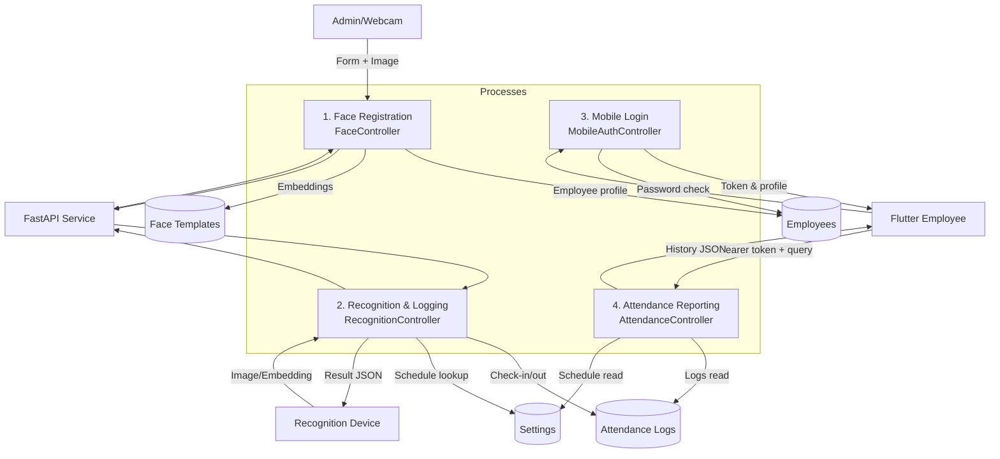
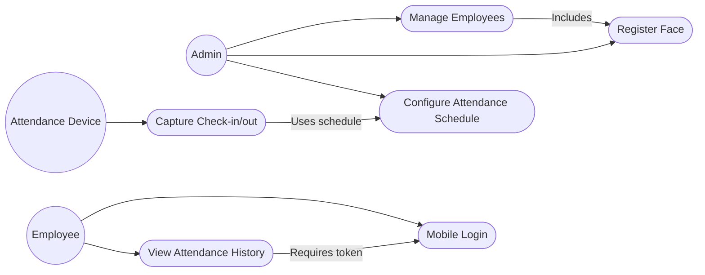
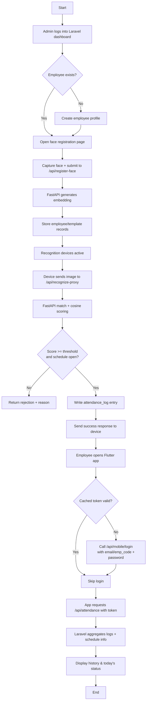

# System Diagrams: Web & Mobile Face Attendance Platform

This document captures the high-level views the user requested: context, data flow, use cases, entity relationships, and the operational flow spanning the Laravel backend, FastAPI recognition service, and Flutter mobile client.

---

## 1. Context Diagram

```mermaid
flowchart LR
    subgraph Clients
        A[Admin Web Browser]
        B[Face Capture Device<br/> (webcam or kiosk)]
        C[Flutter Mobile App]
    end

    subgraph Backend
        D[Laravel API<br/> routes/web.php & routes/api.php]
        E[(Database<br/> employees/face_templates/attendance_logs/settings)]
        F[Storage (images/embeddings)]
    end

    G[FastAPI Recognition Service]

    A <--> D
    B --> D
    C <--> D
    D <--> E
    D --> F
    D <--> G
```

**Key points**
- Every client (web admin, face device, Flutter app) communicates with Laravel; only Laravel talks to the database.
- FastAPI is invoked only by Laravel when embeddings need to be generated or matched.

---

## 2. Data Flow Diagram (Level 1)



---

## 3. Use Case Diagram



---

## 4. Entity Relationship Diagram

```mermaid
erDiagram
    EMPLOYEES ||--o{ FACE_TEMPLATES : "has many"
    EMPLOYEES ||--o{ ATTENDANCE_LOGS : "has many"
    SETTINGS ||..|| SETTINGS : "key/value store"

    EMPLOYEES {
        bigint id PK
        string emp_code
        string first_name
        string last_name
        string email
        string department
        string position
        string password (hashed)
        boolean active
    }

    FACE_TEMPLATES {
        bigint id PK
        bigint employee_id FK
        string image_path
        json embedding
        string model
        float score
        string source
    }

    ATTENDANCE_LOGS {
        bigint id PK
        bigint employee_id FK
        string emp_code
        enum action (time_in/time_out)
        timestamp logged_at
        boolean is_late
        float confidence
        boolean liveness_pass
        bigint device_id
        json meta
    }

    SETTINGS {
        bigint id PK
        string key UNIQUE
        json value
    }
```

Notes:
- `settings` acts as a simple key-value store; the `attendance.schedule` key drives both recognition gating and attendance reporting.
- `attendance_logs.emp_code` duplicates the employee code for resilience when the foreign key is null (e.g., failed recognition).

---

## 5. Operational Flowchart



---

Refer to this document alongside `docs/WEB_MOBILE_DB_FLOW.md` for textual explanations of each component.