# Face Attendance System - Complete Flow Documentation

## System Overview

The Face Attendance System is a comprehensive Laravel-based application that uses computer vision for employee attendance management. The system integrates face recognition technology with a modern web interface to provide seamless attendance tracking.

### Key Components
- **Frontend**: HTML/JavaScript with face-api.js for real-time face detection
- **Backend**: Laravel 12 with Livewire for reactive components
- **Face Recognition**: FastAPI service for embedding extraction
- **Database**: SQLite with proper relationships and constraints
- **Authentication**: Laravel Fortify with 2FA support

---

## 1. System Architecture Diagram

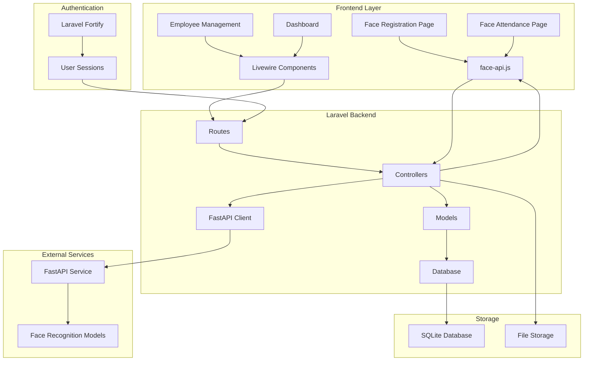

---

## 2. User Registration Flow

### Visual Flowchart

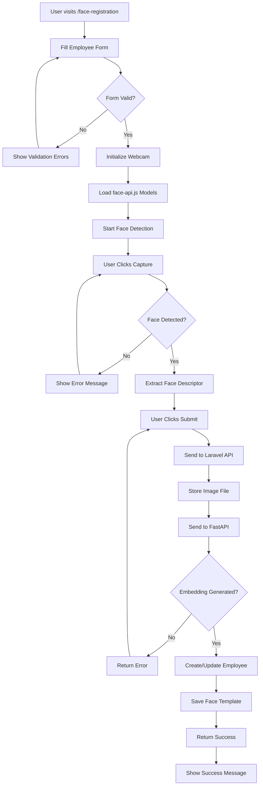

### Step-by-Step Process

**Prerequisites:**
- User must be authenticated
- Webcam access granted
- FastAPI service running

**Detailed Steps:**

1. **Form Initialization**
   - User navigates to `/face-registration`
   - Form loads with fields: Employee Code, Name, Email
   - CSRF token included for security

2. **Face Detection Setup**
   - Webcam stream initialized
   - face-api.js models loaded (TinyFaceDetector, FaceLandmark68Net, FaceRecognitionNet)
   - Real-time face detection overlay displayed

3. **Face Capture**
   - User positions face in camera view
   - Clicks "Capture Face" button
   - System detects single face and extracts descriptor
   - Visual feedback provided

4. **Data Submission**
   - Form data and captured image sent to `/api/register-face`
   - Image stored in `storage/app/public/face_templates/{employee_id}/`
   - Image sent to FastAPI for embedding extraction

5. **Database Operations**
   - Employee record created/updated in `employees` table
   - Face template saved in `face_templates` table
   - All operations wrapped in database transaction

6. **Success Response**
   - Success message displayed
   - Form cleared
   - User redirected or can register another face

---

## 3. Face Attendance Flow

### Visual Flowchart

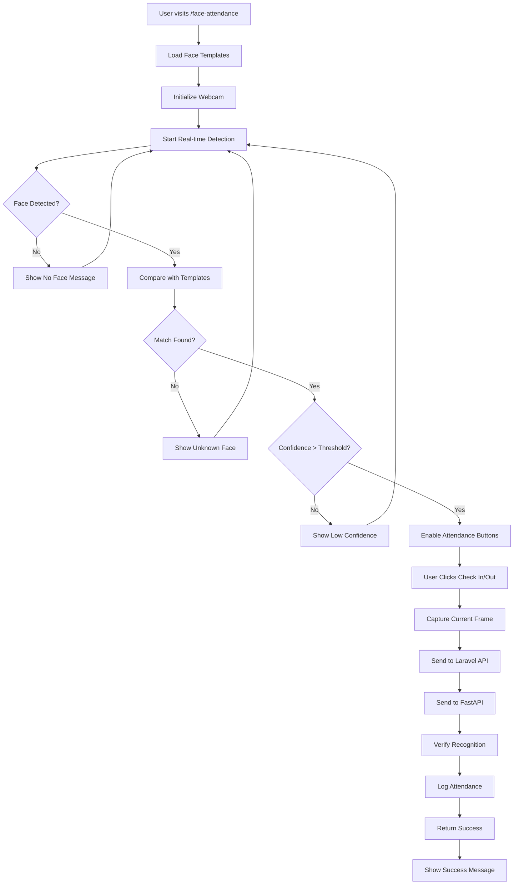

### Step-by-Step Process

**Prerequisites:**
- At least one face template registered
- Webcam access granted
- FastAPI service running

**Detailed Steps:**

1. **Template Loading**
   - System loads all face templates from database
   - Converts embeddings to Float32Array format
   - Prepares for real-time comparison

2. **Real-time Detection**
   - Webcam stream initialized
   - Continuous face detection running
   - Face landmarks and descriptors extracted

3. **Face Matching**
   - Current face descriptor compared with all templates
   - Euclidean distance calculated for each template
   - Best match identified with confidence score

4. **Confidence Check**
   - If confidence > 0.45 threshold, face is recognized
   - Attendance buttons enabled
   - Employee name and confidence displayed

5. **Attendance Logging**
   - User clicks "Check In" or "Check Out"
   - Current video frame captured
   - Image sent to `/api/recognize-proxy` for verification

6. **Verification Process**
   - Laravel sends image to FastAPI
   - FastAPI extracts embedding and matches with database
   - Attendance logged in `attendance_logs` table

7. **Success Response**
   - Success message with confidence score
   - Attendance record created
   - System ready for next attendance

---

## 4. Authentication Flow

### Visual Flowchart

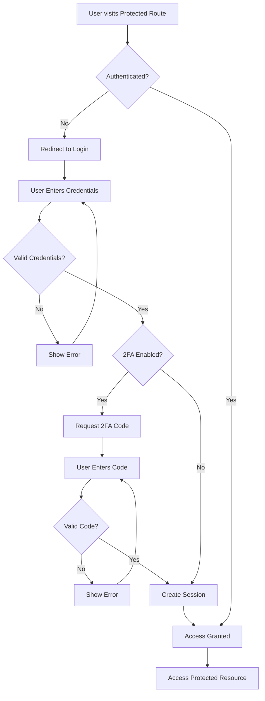

### Step-by-Step Process

**Prerequisites:**
- User account exists
- Password set
- 2FA configured (optional)

**Detailed Steps:**

1. **Route Protection**
   - Middleware checks authentication status
   - Unauthenticated users redirected to login

2. **Login Process**
   - User enters email and password
   - Laravel Fortify validates credentials
   - Session created upon successful authentication

3. **Two-Factor Authentication**
   - If 2FA enabled, user prompted for code
   - Code verified against stored secret
   - Additional security layer applied

4. **Session Management**
   - Session cookie set
   - User authenticated for subsequent requests
   - Session timeout configured

5. **Access Control**
   - Authenticated users access protected routes
   - User permissions checked
   - Activity logged for audit

---

## 5. Admin Management Flow

### Visual Flowchart

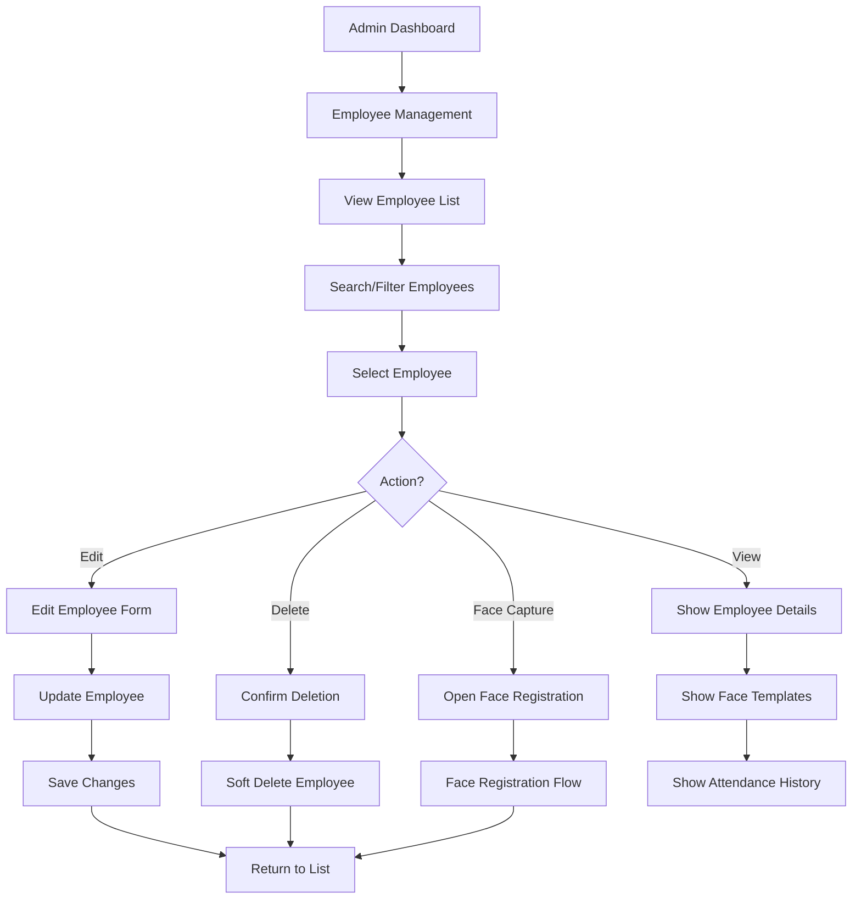

### Step-by-Step Process

**Prerequisites:**
- Admin user authenticated
- Appropriate permissions granted

**Detailed Steps:**

1. **Dashboard Access**
   - Admin logs in and accesses dashboard
   - Overview statistics displayed
   - Quick action buttons available

2. **Employee Management**
   - Navigate to employee list
   - Search and filter functionality
   - Pagination for large datasets

3. **Employee Operations**
   - **View**: Display employee details, face templates, attendance history
   - **Edit**: Update employee information
   - **Delete**: Soft delete employee (preserves data integrity)
   - **Face Capture**: Register additional face templates

4. **Face Template Management**
   - View all face templates for employee
   - Delete specific templates
   - Add new templates

5. **Attendance Monitoring**
   - View attendance logs
   - Filter by date range
   - Export attendance reports

---

## 6. Technical Data Flow

### Visual Flowchart

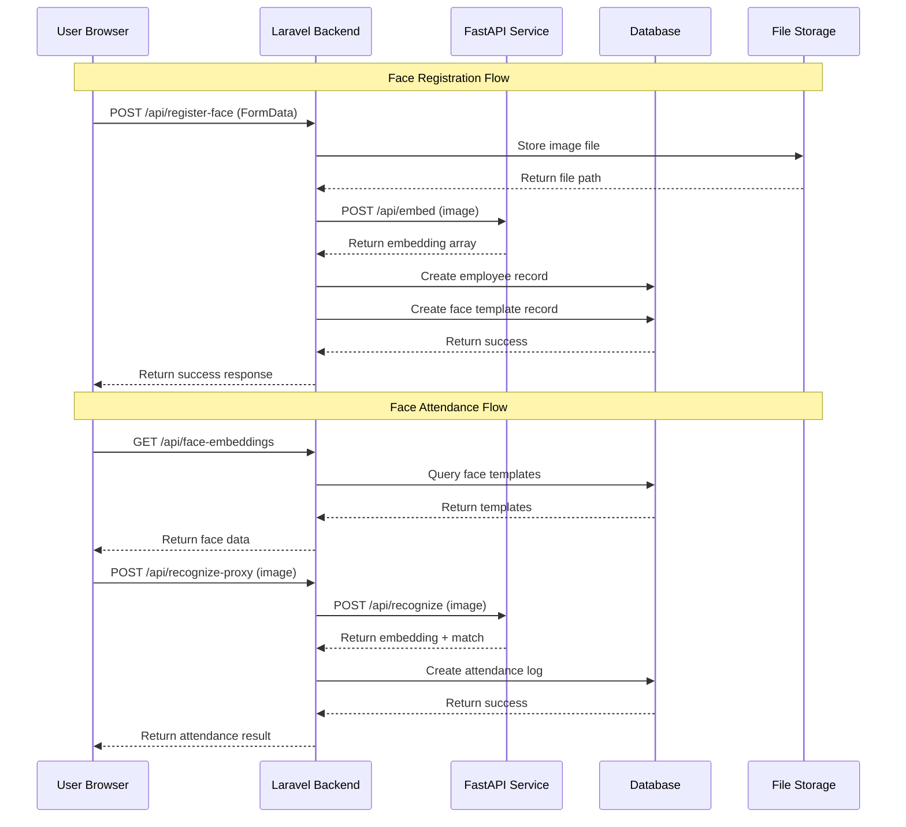

### Data Flow Details

**Face Registration Data Flow:**

1. **Frontend to Laravel**
   - FormData with image, employee code, name, email
   - CSRF token for security
   - Multipart form submission

2. **Laravel Processing**
   - Validate input data
   - Store image in public storage
   - Prepare image for FastAPI

3. **Laravel to FastAPI**
   - Send image via HTTP multipart
   - Include API key for authentication
   - Wait for embedding response

4. **Database Operations**
   - Create/update employee record
   - Store face template with embedding
   - Use database transactions

5. **Response to Frontend**
   - Success message with employee details
   - File path for stored image
   - Error handling for failures

**Face Attendance Data Flow:**

1. **Template Loading**
   - Fetch all face templates from database
   - Convert embeddings to JavaScript arrays
   - Prepare for client-side matching

2. **Real-time Recognition**
   - Client-side face detection and matching
   - Confidence threshold checking
   - User interaction for attendance

3. **Attendance Verification**
   - Send current frame to Laravel
   - Laravel forwards to FastAPI for verification
   - Double-check recognition accuracy

4. **Attendance Logging**
   - Create attendance log record
   - Include confidence score and metadata
   - Return success confirmation

---

## 7. Database Schema Flow

### Visual Schema Diagram

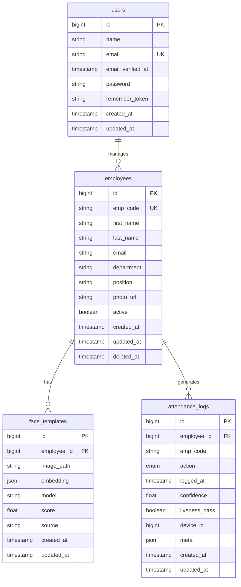

### Database Relationships

**Primary Relationships:**

1. **users → employees**
   - One-to-many relationship
   - Users can manage multiple employees
   - Soft delete on employees preserves data

2. **employees → face_templates**
   - One-to-many relationship
   - Employee can have multiple face templates
   - Cascade delete on employee removal

3. **employees → attendance_logs**
   - One-to-many relationship
   - Employee can have multiple attendance records
   - Null on delete preserves audit trail

**Key Constraints:**

- `emp_code` must be unique across employees
- `email` must be unique across users
- `employee_id` foreign keys must reference existing employees
- Soft deletes preserve data integrity
- JSON fields store complex data (embeddings, metadata)

---

## 8. Error Handling Flow

### Visual Flowchart

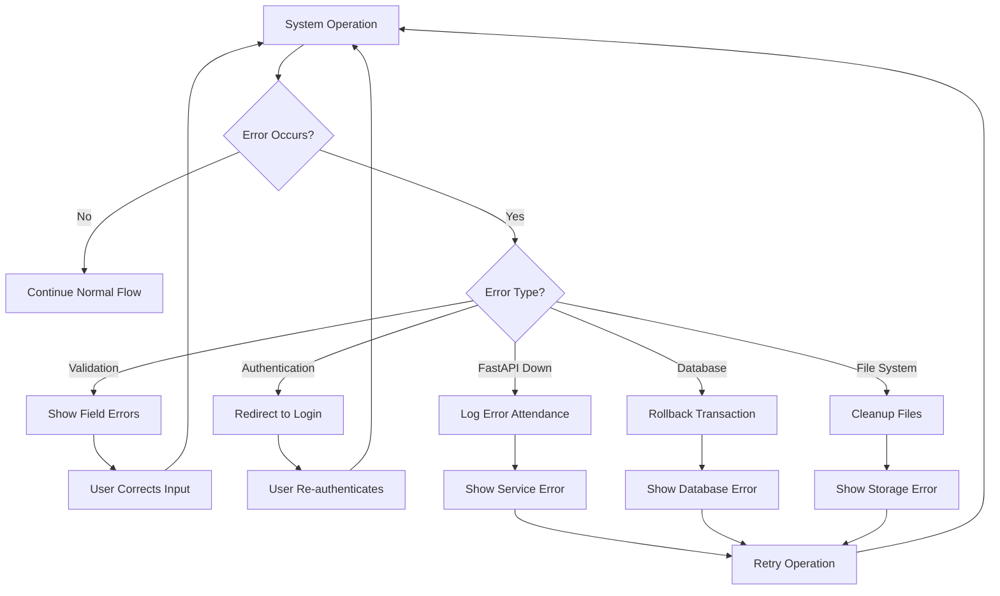

### Error Handling Details

**Validation Errors:**
- Client-side validation for immediate feedback
- Server-side validation for security
- Clear error messages for user correction

**Authentication Errors:**
- Session timeout handling
- Invalid credentials messaging
- 2FA failure handling

**Service Errors:**
- FastAPI service unavailable
- Network timeout handling
- Graceful degradation

**Database Errors:**
- Transaction rollback on failure
- Constraint violation handling
- Connection error management

**File System Errors:**
- Storage quota exceeded
- Permission denied
- File corruption handling

---

## 9. Security Flow

### Visual Flowchart

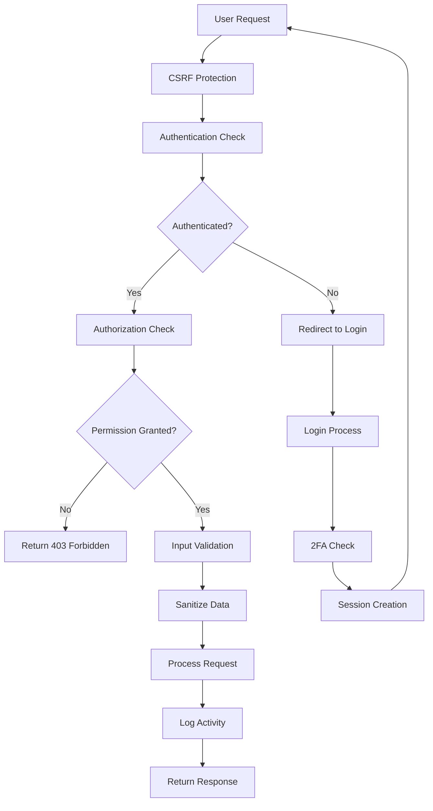

### Security Measures

**Authentication:**
- Laravel Fortify integration
- Session-based authentication
- Two-factor authentication support
- Password confirmation for sensitive operations

**Authorization:**
- Route middleware protection
- Permission-based access control
- Role-based restrictions

**Data Protection:**
- CSRF token validation
- Input sanitization
- SQL injection prevention
- XSS protection

**API Security:**
- API key authentication for FastAPI
- Rate limiting implementation
- Request validation
- Error message sanitization

**Audit Trail:**
- Activity logging
- Attendance record preservation
- Error tracking
- Security event monitoring

---

## 10. Performance Optimization Flow

### Visual Flowchart

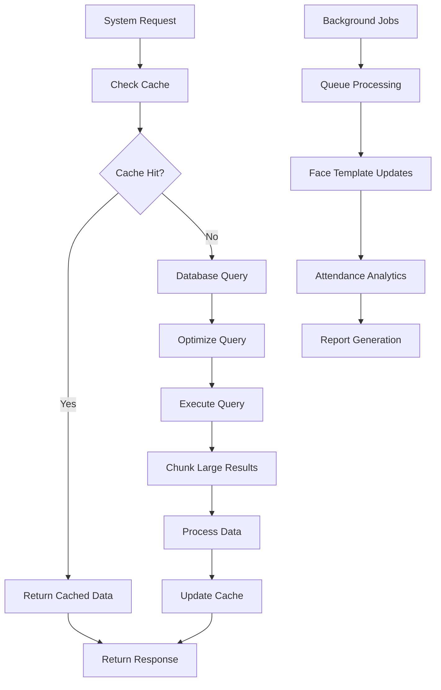

### Performance Optimizations

**Database Optimizations:**
- Chunked processing for large datasets
- Efficient relationship loading
- Proper indexing on key fields
- Query optimization

**Caching Strategy:**
- Face template caching
- Session data caching
- API response caching
- Static asset caching

**Background Processing:**
- Queue system for heavy operations
- Asynchronous face processing
- Scheduled cleanup tasks
- Report generation

**Frontend Optimizations:**
- Lazy loading of face models
- Efficient face detection
- Optimized image processing
- Responsive design

---

## 11. Deployment Flow

### Visual Flowchart

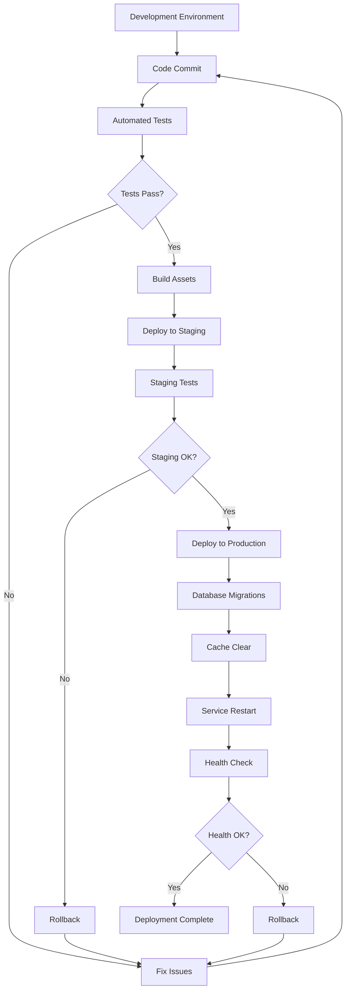

### Deployment Process

**Pre-deployment:**
- Code review and testing
- Database migration preparation
- Asset compilation
- Environment configuration

**Deployment Steps:**
1. Deploy application code
2. Run database migrations
3. Clear application cache
4. Restart web services
5. Verify service health

**Post-deployment:**
- Monitor system performance
- Check error logs
- Verify functionality
- Update documentation

**Rollback Procedure:**
- Identify deployment issues
- Revert to previous version
- Restore database backup if needed
- Verify system stability

---

## 12. Monitoring and Maintenance Flow

### Visual Flowchart

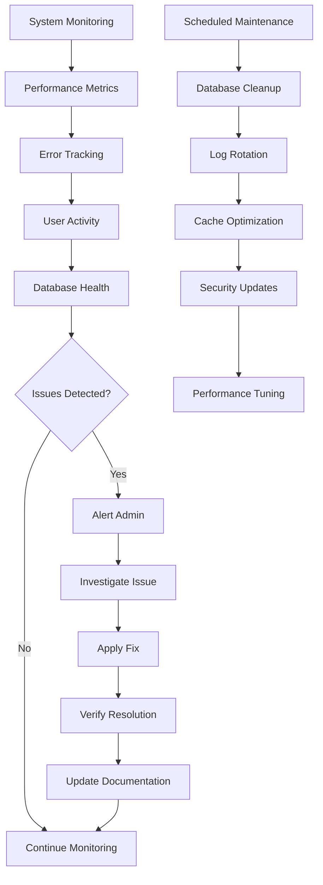

### Monitoring Areas

**System Performance:**
- Response time monitoring
- Memory usage tracking
- CPU utilization
- Disk space monitoring

**Application Health:**
- Error rate tracking
- Success rate monitoring
- User session tracking
- API endpoint health

**Database Monitoring:**
- Query performance
- Connection pool status
- Storage usage
- Backup verification

**Security Monitoring:**
- Failed login attempts
- Suspicious activity
- API abuse detection
- Security event logging

**Maintenance Tasks:**
- Regular database cleanup
- Log file rotation
- Cache optimization
- Security updates
- Performance tuning

---

## Conclusion

This comprehensive flow documentation covers all aspects of the Face Attendance System, from user interactions to technical implementations. The system provides a robust, secure, and efficient solution for face-based attendance management with proper error handling, security measures, and performance optimizations.

For specific implementation details, refer to the individual component documentation and API endpoints guide.
