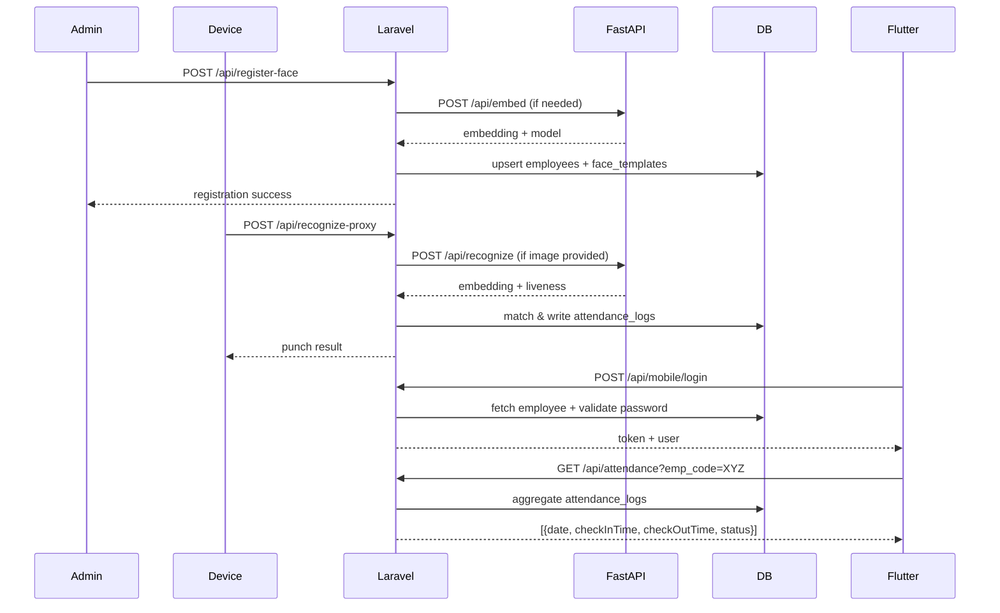

# Web, Mobile, and Database Flow

## 1. Top-Level Architecture

```
           +--------------------+        +----------------------+        +----------------+
Web Admin  |  Livewire / Blade  |        |                      |        |                |
Flutter    |  Flutter (mobile)  | <----> |  Laravel API Layer   | <----> |   Database     |
Devices    |  Camera Kiosks     |        |  (routes/api.php)    |        | (employees,    |
           +--------------------+        +----------------------+        |  logs, etc.)   |
                |    |                          |    ^                  +----------------+
                |    +--------------------------+    |
                |      FastAPI proxy (embeddings)    |
                +------------------------------------+
```

* **Web admin UI** lives in the Laravel project (`routes/web.php`) and controls employees, schedules, and face registration.
* **Flutter mobile app** (`mobile_attendance_system/lib`) talks to the same REST API to authenticate employees and show their attendance.
* **Recognition devices** call `/api/register-face` or `/api/recognize-proxy`, which may forward images to FastAPI for embedding extraction.
* **Database** stores the canonical data in `employees`, `face_templates`, `attendance_logs`, and `settings`.

---

## 2. Web Admin & Face Registration Flow

1. Admin signs in through Fortify/Livewire dashboards (`routes/web.php:11-119`).
2. Static capture pages under `public/FaceApi/frontend` stream the webcam, extract descriptors with face-api.js, and POST to `/api/register-face`.
3. `FaceController@register` (`app/Http/Controllers/FaceController.php:30-135`) validates inputs, uploads the image to `storage/app/public`, calls FastAPI when an embedding is missing, and wraps the following in a DB transaction:
   * Create/update the `employees` row (code, name, email, hashed password field if provided).
   * Insert a `face_templates` record with `embedding`, `image_path`, `model`, and metadata.
4. `FaceController@embeddings` exposes all descriptors so offline devices can sync without repeated uploads.

---

## 3. Recognition & Attendance Logging Flow

1. A kiosk/mobile browser hits `/api/recognize-proxy` with either an image upload or a JSON array of floats (`routes/api.php:16`).
2. `RecognitionController@proxy` (`app/Http/Controllers/RecognitionController.php:47-355`) performs:
   * FastAPI proxy when an image is present, or reuses the provided embedding.
   * Cosine comparison against every stored `face_templates` embedding to find the best match.
   * Schedule validation using the cached `attendance.schedule` setting from the `settings` table.
   * Duplicate detection for the current day (prevents double time-in/out).
3. When the best score exceeds the configured threshold, an `attendance_logs` row is stored with confidence, device id, `is_late`, and liveness metadata.
4. Responses explain whether the punch was accepted, rejected because of schedule limits, or skipped due to low confidence, keeping devices stateless.

---

## 4. Mobile App Flow

The Flutter client is a read-only companion for employees.

### Authentication

1. Splash screen loads cached token/user via `AuthProvider.initialize` (`lib/providers/auth_provider.dart:22-36`, `lib/screens/splash_screen.dart:18-37`).
2. `LoginScreen` accepts either an email or `emp_code` plus password (`lib/screens/login_screen.dart:26-106`).
3. `ApiService.login` (`lib/services/api_service.dart:10-31`) POSTs to `/api/mobile/login`, which is handled by `MobileAuthController@login` (`app/Http/Controllers/MobileAuthController.php:15-73`):
   * Finds the employee record.
   * Validates the hashed password stored on the employee (see `database/migrations/2025_10_12_130000_add_password_to_employees_table.php`).
   * Returns `{ success, token, user }`, which `AuthProvider` caches in `SharedPreferences` for auto-login.

### Attendance Timeline

1. `HomeScreen` lets the user pick month/year, then calls `AttendanceProvider.refresh` (`lib/providers/attendance_provider.dart:14-45`).
2. `ApiService.getAttendanceRecords` builds query params (`email`, `emp_code`, `from`, `to`) and calls `/api/attendance` with `Authorization: Bearer <token>` (`lib/services/api_service.dart:33-69`).
3. `AttendanceController@index` aggregates `attendance_logs` into day rows with `checkInTime`, `checkOutTime`, and `status` tags (`app/Http/Controllers/AttendanceController.php:14-174`).
4. Flutter renders the "Today" card plus the month history (`lib/screens/home_screen.dart:14-205`).

---

## 5. Database Touchpoints

| Table | Source Files | Purpose |
|-------|-------------|---------|
| `employees` (`database/migrations/2025_10_08_050000_create_employees_table.php`) | `FaceController`, `MobileAuthController`, Livewire CRUD | Master identity (code, names, email, department, hashed password). |
| `face_templates` (`database/migrations/2025_10_08_050010_create_face_templates_table.php`) | `FaceController`, `RecognitionController` | Stores embeddings/images per employee for cosine comparison. |
| `attendance_logs` (`database/migrations/2025_10_08_050020_create_attendance_logs_table.php`) | `RecognitionController`, `AttendanceController` | Every punch with timestamps, device id, late flag, and meta. |
| `settings` (`database/migrations/2025_10_12_000001_create_settings_table.php`) | `RecognitionController`, `AttendanceController`, dashboard | JSON blobs (attendance windows, enabled days, grace minutes, date ranges). |

Relationships and casting logic are defined in `app/Models/Employee.php`, `FaceTemplate.php`, `AttendanceLog.php`, and `Setting.php`.

---

## 6. End-to-End Sequence



---

## 7. Key Configuration Points

* `.env` (backend):
  * `FASTAPI_URL` and `FASTAPI_SECRET` for recognition proxy.
  * Database driver/credentials (SQLite/MySQL/Postgres).
* `mobile_attendance_system/lib/config/api_config.dart`:
  * Detects host/port automatically; override with `--dart-define=API_BASEURL=https://example.com/api`.
* `settings` table (`attendance.schedule` key):
  * `{ "days": [1,2,3,4,5], "in_start": "06:00", "in_end": "08:00", "late_after": "07:45", "late_grace": 5, "out_start": "16:00", "out_end": "17:00" }`
  * Shared by recognition (enforces windows) and reporting (late status).

---

## 8. Operational Notes

* Always create/populate the employee record before registering faces so descriptors are linked to the correct `employee_id`.
* The mobile token is currently an opaque random string; for production deployments consider Laravel Sanctum/Passport for revocable tokens.
* `/api/debug/database` (`routes/api.php:22-43`) is a quick health check showing counts from all primary tables and should be your first stop when diagnosing sync issues between devices and the mobile UI.

---

This document bridges the Laravel backend, Flutter client, and persistence layer so onboarding developers can follow the complete flow without diving into every file first.
